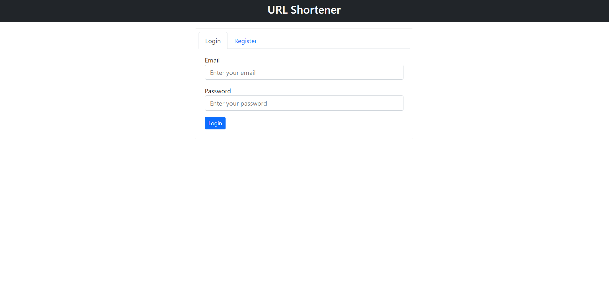
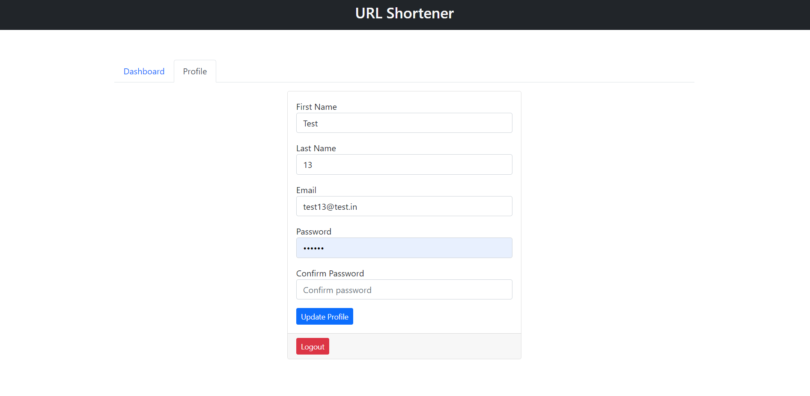

# URL Shortener

A simple application to shorten long urls with custom short id.

## Technologies

> `HTML, Bootstrap(CSS), JS, Node+Express JS, MySQL`

## Features

- Create, Edit, Delete Short id.
- Ensures Authentication and Authorization.

### Screenshots

 

#1 Login, Register | #2, #3 Dashboard | #4 Profile

